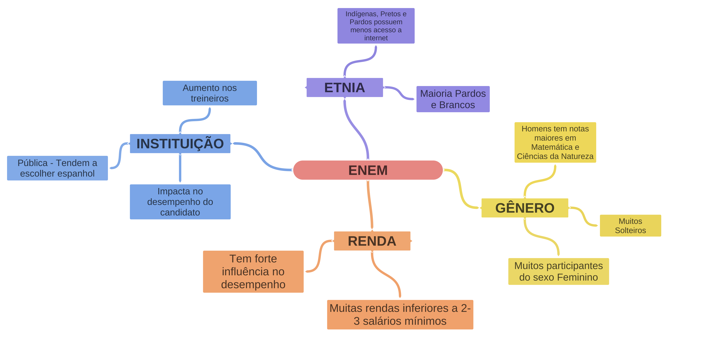

# Projeto de Análise de Dados do ENEM

Este projeto tem como propósito aplicar conhecimentos adquiridos por meio da leitura de livros e estudo autodidata, visando o autodesenvolvimento. Utilizando dados reais do ENEM disponíveis no site do INEP, a análise contempla informações das provas realizadas em todos os Estados brasileiros entre os anos de 2015 e o ano atual. Destaco que o processo de obtenção dessas informações envolve o uso de um web scraper implementado com Selenium, permitindo o download direto do site do governo.

## 🚀 Visão Geral

A análise explora, de maneira macro, as notas do ENEM, investigando a relação entre as pontuações alcançadas e variáveis como a renda declarada no questionário socioeconômico, além de explorar a possível influência de fatores como acesso à internet e o tipo de instituição de ensino nas notas dos participantes. É relevante observar que dados de candidatos sem nota (NaN) em qualquer uma das matérias ou na redação foram excluídos da análise.

Para facilitar a compreensão da análise, o projeto está organizado em seções e subseções, fornecendo descrições detalhadas das conclusões obtidas em cada etapa. Os códigos estão comentados para proporcionar clareza sobre o raciocínio adotado durante o desenvolvimento do notebook.

## 📑 Seções do Projeto

1. **Importação das Bibliotecas e Configurações:**
   - Nesta seção, são importadas as bibliotecas necessárias para o desenvolvimento do projeto.

2. **Importação do Dataset:**
   - Aqui, é realizado o processo de leitura dos arquivos zip baixados com o web scraper. Optou-se por não extrair os arquivos devido ao seu tamanho, aproximadamente 30 milhões de linhas. O processo envolve a seleção criteriosa das colunas utilizadas na análise e a remoção de linhas sem informações de notas.

3. **Overview dos Dados:**
   - Verificação do peso do dataset e integridade dos dados, identificando possíveis informações incorretas ou discrepantes.

4. **Análises Estatísticas (Visão Macro):**
   - Análise geral das informações do dataset, explorando variáveis como gênero, renda, presença, notas, entre outras.

5. **Criação e Análise das Hipóteses:**
   - Desenvolvimento e teste de 5 hipóteses, utilizando um fluxograma para facilitar a compreensão.

6. **Análises Adicionais:**
   - Esta seção aborda análises que não estão diretamente relacionadas ao objetivo principal, ampliando o escopo da investigação.

7. **Conclusão do Projeto:**
   - Considerações finais a respeito dos resultados obtidos durante a análise.

8. **Compactação dos Dados em Formato JSON para o Streamlit:**
   - Etapa relacionada à compactação dos dados para utilização em um dashboard criado com Streamlit e Plotly, proporcionando uma visualização geoespacial dos dados do ENEM.

## 📊 Explore o Dashboard

Por fim você pode dar uma olhada no dashboard interativo gerado por este projeto :)
Clique no distintivo abaixo para acessar:

Teste a interatividade e veja um pouco mais sobre os dados do ENEM!
